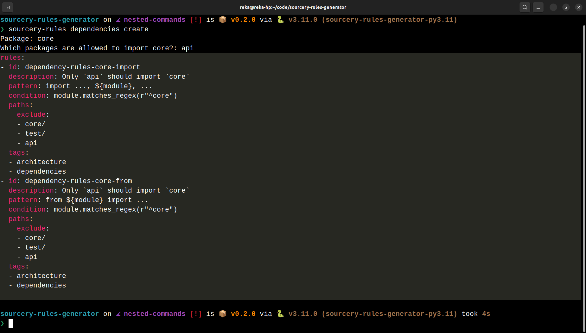

# Sourcery Rules Generator 

Sourcery Rules Generator creates architecture rules for your project.

The generated rules can be used by Sourcery to review your project's architecture.

Currently, the project can create dependency rules.

Usage:

```
sourcery-rules dependencies create
```

You'll be prompted to provide:

* a package name
* the packages that are allowed to import the package above

The 2nd parameter is optional.  
E.g. it makes sense to say that no other package should import the `api` or `cli` package of your project.

